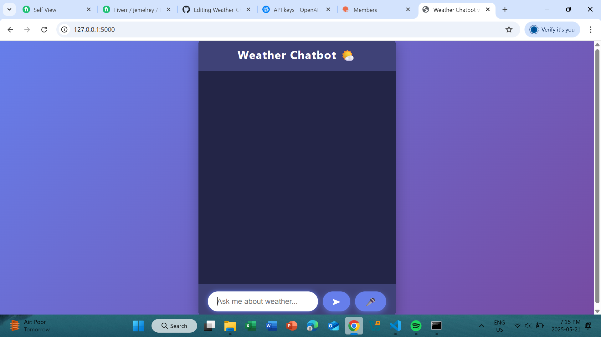

# 🌤️ Weather Chatbot Web App

A sleek, voice-enabled chatbot built with **Python (Flask)** and **HTML/CSS/JavaScript**, designed to provide weather updates through a beautiful and responsive web interface.

## 🚀 Features

- 🌍 Get weather updates for any city in real time
- 🎤 Voice input using Web Speech API
- 🗣️ Voice response using Speech Synthesis
- 💬 Beautiful chat UI with bubble-style messages
- 📱 Mobile-responsive layout
- 🌈 Modern gradient background and clean design

---

## 🧰 Tech Stack

- **Backend:** Python + Flask
- **Frontend:** HTML, CSS, JavaScript
- **APIs:** OpenWeatherMap API
- **Voice:** Web Speech API (Speech Recognition & Synthesis)

---

## 🖼️ Preview

 <!-- Add your screenshot and rename accordingly -->

---

## 🔧 Setup Instructions

### 1. Clone the repository
```bash
git clone https://github.com/your-username/weather-chatbot.git
cd weather-chatbot
2. Install dependencies
bash
Copy
Edit
pip install flask requests
3. Get OpenWeatherMap API Key
Sign up at https://openweathermap.org/

Go to API keys in your dashboard and generate a key.

4. Update your API key
In your app.py, replace:

python
Copy
Edit
api_key = "your_api_key"
with your actual API key.

5. Run the app
bash
Copy
Edit
python app.py
Then open your browser and go to:

cpp
Copy
Edit
http://127.0.0.1:5000
